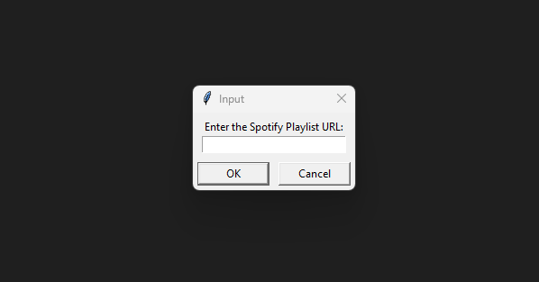

# spotdl-inputbox

An input box for spotDL downloader written in Python

## Application context

spotDL finds songs from Spotify playlists on YouTube and downloads them - along with album art, lyrics and metadata.

The resulting code called spotdl-inputbox.py is a Python script that implements an input box. It requires the Python interpreter.

## Instructions

Download the files as a zip using the green button, or clone the repository to your machine using Git.

In:

[spotdl-inputbox\spotdl-inputbox.py](spotdl-inputbox.py)

This .py is a Python script. This script creates a GUI (Graphical User Interface) with a button. Before proceeding, ensure you have spotDL [spotDL/spotify-downloader 24] installed. When clicked, it:

1. Prompts the user to enter the URL of a Spotify playlist.



2. Asks the user to select a directory where the playlist will be downloaded.
3. Changes the working directory to the selected directory.
4. Runs the spotdl command to download the playlist to the chosen directory.

## Implementation

In:

[spotdl-inputbox\spotdl-inputbox.py](spotdl-inputbox.py)

```
import tkinter as tk
from tkinter import simpledialog
from tkinter import filedialog
import subprocess
import os

class SpotifyDownloaderGUI:
    def __init__(self, root):
        self.root = root
        root.title('Spotify Playlist Downloader')

        # Create download button
        self.download_button = tk.Button(root, text='Download Spotify Playlist', command=self.download_playlist)
        self.download_button.pack(pady=20)

    def download_playlist(self):
        # Ask for Spotify playlist URL
        url = simpledialog.askstring("Input", "Enter the Spotify Playlist URL:", parent=self.root)

        if url:
            # Ask for directory to save the playlist
            directory = filedialog.askdirectory()

            if directory:
                # Change working directory to the selected directory
                os.chdir(directory)

                # Run spotDL command
                subprocess.run(['spotdl', url])

if __name__ == '__main__':
    root = tk.Tk()
    gui = SpotifyDownloaderGUI(root)
    root.mainloop()
```

## Reference

[spotDL/spotify-downloader 24] spotDL. “Download your Spotify playlists and songs along with album art and metadata (from YouTube if a match is found)”. GitHub software repository. April 2024.  
Available at: https://github.com/spotDL/spotify-downloader

## Disclaimer

This software is for educational purposes only. It should not be used for illegal activity. The author is not responsible for its use. Do not be a dick.
